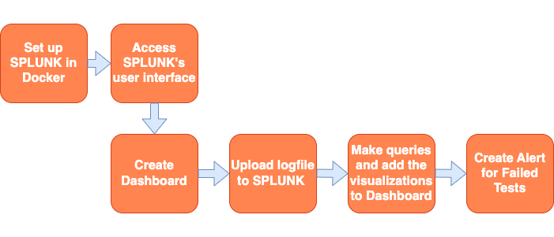

__Welcome to the Splunk Dashboard tutorial!__

**Motivation - Why is this important for DevOps?**  
In this tutorial, you will get an introduction to the Splunk tool and how to create nice Dashboards. Dashboards are used to convert logs into a easily readable format. This can be helpful for developers to understand the result of builds and tests faster. When monitoring logs in real time, alerts can be useful for triggering new actions, or to alert developers that a something has happened in the logs.

**Background**  
The Splunk tool can help us with a lot of things. As mentioned earlier Dashboards and log monitoring is a commonly used features in Splunk. It can also be used for security analysis and DevSecOps.

**Intended Learning Outcomes**  
In this tutorial you will follow these steps:

- Set up Splunk in Docker. 

- Add example build logs to Splunk.

- Build a custom Dashboard in Splunk for the logs.

- Create alerts in Splunk.

